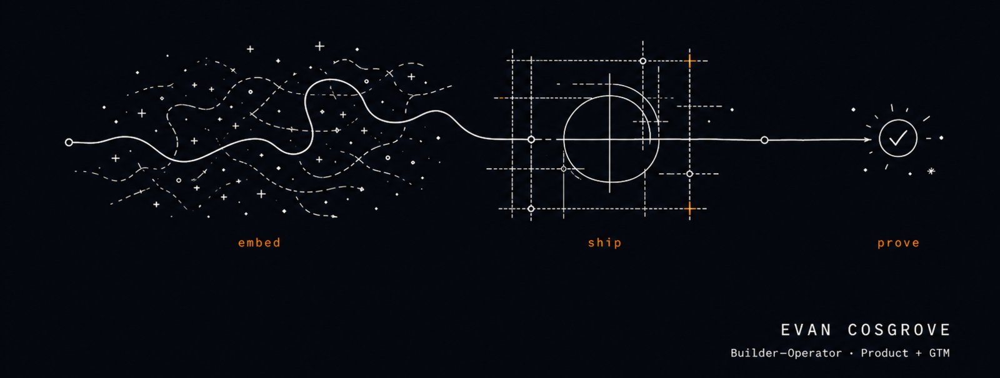

<picture>
  <source media="(prefers-color-scheme: dark)" srcset="./assets/profile-hero-dark.png">
  <source media="(prefers-color-scheme: light)" srcset="./assets/profile-hero-light.png">
  
</picture>

## I turn workflows held together by tabs and optimism into systems people can rely on.

### [Mindara](https://mindara.io)

**The plan was everywhere except one place.**

I co-founded Mindara with [Justin Casso](https://github.com/jrcasso) to bring grounded discovery, live Resy availability, user approval, and booking into one working flow. Its production stack uses Claude for heavier reasoning and Gemini for high-volume work through Vertex AI.

I also built a recursive Maestro harness that replays mobile journeys and routes screenshots, motion, and failures through design, UX, and implementation agents.

**400 daily active users. iOS launching soon, with nearly 500 on the launch-day waitlist.**

### Brazilian Direct

**The sales history was there. The next action was not.**

In a consulting engagement, I rebuilt the client's legacy PHP sales stack as a Symfony 7 CRM, bringing lead management, calendar booking, and Gemini-powered calling and email agents into one system.

I analyzed 20+ years of sales and email history with Hume sentiment analysis to redesign follow-up and the lead-to-sale journey.

**20%+ lift in lead-to-sale conversion.**

### Google

**The growth problem lived between the teams.**

Across a $90M+ Ads portfolio, customer goals, agency implementations, and production data flows did not always line up. I traced those gaps with customers, agencies, and engineering, then carried them through to working Ads API fixes.

**$25M+ in incremental growth.**

## A few things I've shipped

**[claude-cowork-1m-patch](https://github.com/evanjcosgrove/claude-cowork-1m-patch)**: resolved a [month-old Claude Desktop regression](https://github.com/anthropics/claude-code/issues/37413) in 48 hours.

**[production case studies](https://github.com/evanjcosgrove/fde-case-studies)**: what I built, why I built it that way, and what happened next.

---

Brooklyn, NY · [evanjcosgrove.com](https://evanjcosgrove.com) · [LinkedIn](https://www.linkedin.com/in/evanjcosgrove/) · [Mindara](https://mindara.io) · [email](mailto:evanjcosgrove@gmail.com)

```text
          +---------+
signal -->|  build  |--> shipped
          +---------+
```
